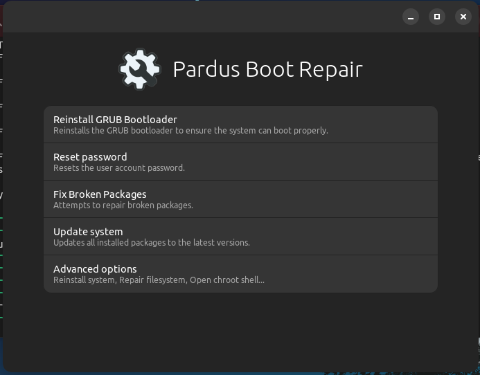
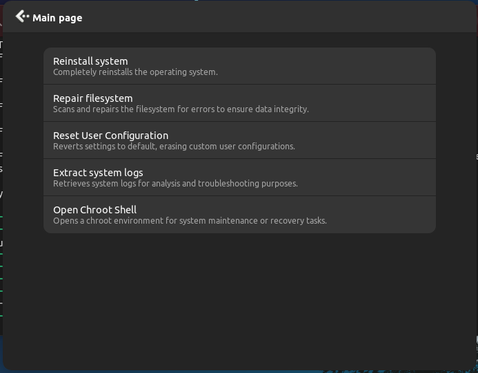
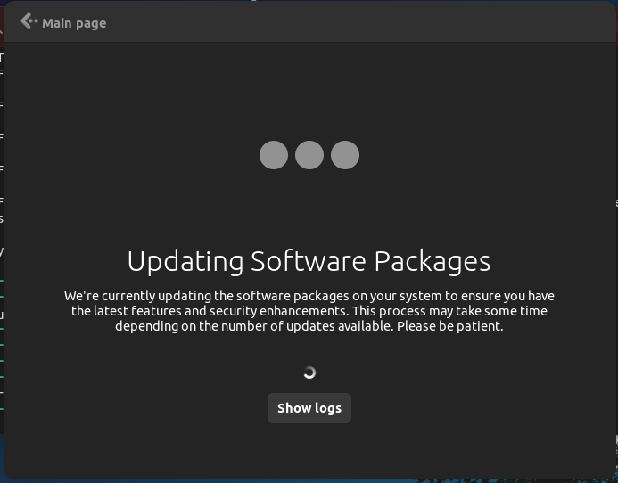
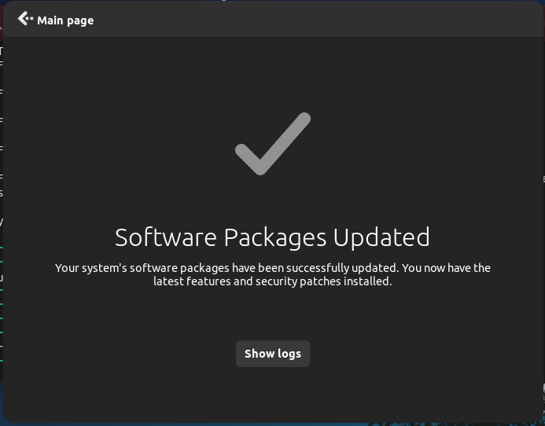
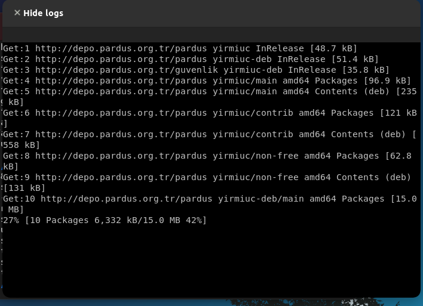

# Pardus Boot Repair
Boot repair tool for pardus.

## Screenshots 





## Features:
* grub repair
* password reset
* open chroot shell
* system reinstallation
* reset user config
* repair partition
* fix broken packages
* full system update
* extracting system logs

## Installation:
Run this command
```shell
make build
```
Then run this command as root
```shell
make install
```

## Dependencies:
* libc6
* live-boot
* zip
* libhandy-1-0
* libvte-2.91-0
* make [MAKE]
* libglib2.0-dev-bin [MAKE]
* gettext [MAKE]

## Testing:
1. Boot live from media.
1. Fetch source and install.
1. Open terminal and run `pardus-boot-repair` as root
